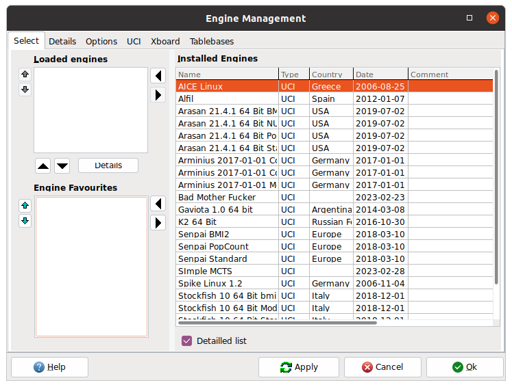
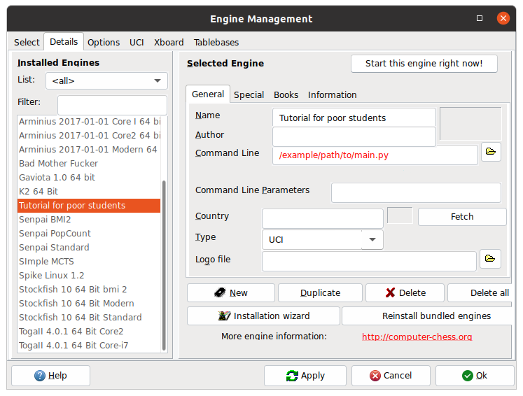

# Bestia pod grunwaldem
Chess engine template made by Krzysztof Łukasiewicz \
Last update: 28.02.2023 22:50

Implements partially standard UCI:
https://gist.github.com/aliostad/f4470274f39d29b788c1b09519e67372

requirements: \
Python version >= 3.10.0 \
python-chess

# How to run on Linux

Download and install some UCI-compatible GUI, e.g. http://www.playwitharena.de/. \
Replace in the file main.py line ```!/path/to/good/interpreter``` with the path to the python interpeter that you would like to use. \
Give executable rights to the file main.py with
```console
chmod +x main.py
```

Open GUI. \
Click Engines -> Manage... \


and then Details. \
Click new and set the name and the path to the executable. \
 \
Eventually click "Start this engine now!". \
The engine should be loaded when you start a new game.
